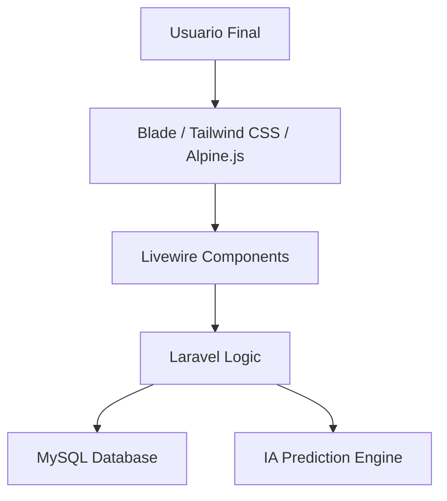

<p align="center"><a href="https://laravel.com" target="_blank"></a></p>
<p align="center">
<a href="https://github.com/laravel/framework/actions"></a>
<a href="https://packagist.org/packages/laravel/framework"></a>
<a href="https://packagist.org/packages/laravel/framework"></a>
<a href="https://packagist.org/packages/laravel/framework"></a>
</p>

# 🌿 AgroSys: Ecosistema de Inteligencia Agrícola

<p align="center">
  
  
  
  
  
</p>

---

## 🏛️ Arquitectura del Sistema (DSS)

AgroSys está diseñado bajo una arquitectura de **Sistemas de Apoyo a las Decisiones (DSS)**, utilizando un stack monolítico moderno de alta reactividad.



### 🛰️ Capas Técnicas

| Dimensión | Tecnología                                          | Propósito Estratégico |
| :--- |:----------------------------------------------------| :--- |
| **Frontend** | **Blade(HTML + PHP)  & Tailwind(Estilos modernos)** | Interfaz atomizada con diseño utilitario y modo oscuro dinámico. |
| **Interactividad** | **Livewire & Alpine.js**                            | Reactividad sin la complejidad de un SPA tradicional. |
| **Backend** | **Laravel 11**                                      | Orquestador de lógica de negocio, colas y seguridad. |
| **Persistencia** | **MySQL**                                           | Almacenamiento relacional con optimización de índices para telemetría. |

---

**🖥️ FRONTEND**
- Blade (HTML + PHP)
- Tailwind CSS (Estilos modernos)
- Alpine.js (Interactividad sin JavaScript complejo)
- React (solo para: 🗺️Mapas, 📊Dashboard, 📈 Gráficos (Recharts/Chart.js), 🌦️Clima & IA)

**⚙️ BACKEND**
- Laravel (Framework PHP)
- Livewire (Componentes dinámicos sin JS)

**🔐 AUTENTICACIÓN**
- Breeze (Login, Registro, Restablecer contraseña)

**🗄️ BASE DE DATOS**
- MySQL
---
## 🛠️ Requerimientos del Centro de Datos

Para el despliegue óptimo, el servidor debe cumplir las siguientes especificaciones:

> [!IMPORTANT]
> **PHP 8.4+** es obligatorio para aprovechar las mejoras de rendimiento y tipado de Laravel 11.

- **Engine:** PHP 8.4.24 ó superior.
- **Dependency Manager:** Composer 2.x.
- **JavaScript Runtime:** Node.js 18.x LTS.
- **React**: React 19.2.8 ó superior
- **Relational DB:** MySQL 8.4.11 ó superior

---

## 🚀 Protocolo de Despliegue

### 🌑 1. Génesis del Proyecto
Inicialización del entorno bajo los estándares de Laravel 11.
```bash
composer create-project laravel/laravel agrosys
cd agrosys
```

### 🔐 2. Blindaje y Reactividad (Breeze & Volt)
Instalación del andamiaje de seguridad con soporte para componentes de archivo único (**Volt**).
```bash
composer require laravel/breeze --dev
php artisan breeze:install livewire --volt
```

### 🎨 3. Compilación de la Interfaz
Instalación de dependencias de diseño y compilación de activos.
```bash
npm install && npm run build
```

### 💾 4. Configuración Energética (.env)
Enlace de la aplicación con el motor de base de datos.
```env
DB_CONNECTION=mysql
DB_HOST=127.0.0.1
DB_DATABASE=NOMBRE_DB
DB_USERNAME=usuario
DB_PASSWORD=password
```

### 🧪 5. Migración de Planos y Semillas
Ejecución de las migraciones para crear la estructura de tablas y cargar los catálogos maestros.
```bash
php artisan migrate:fresh --seed
```

---

## ⚙️ Centro de Operaciones (Comandos)

| Acción | Comando |
| :--- | :--- |
| **Levantar Servidor** | `php artisan serve` |
| **Modo Desarrollo** | `npm run dev` |
| **Actualizar Núcleo** | `composer update` |
| **Limpiar Caché** | `php artisan optimize:clear` |

---

## 🏆 Estatus del Proyecto

- [x] **Traducción:** 🇪🇸 Interfaz totalmente en español.
- [x] **UX/UI:** 🌓 Soporte nativo para Light Mode.
- [x] **Seguridad:** 🛡️ Roles diferenciados (Admin, Agricultor, Supervisor).
- [x] **Preparado para IA:** 🧠 Módulos predictivos en fase de diseño.

---

<p align="center">
  <b>AgroSys</b> • <i>Transformando datos en cosechas inteligentes</i><br>
  Hecho con ❤️ para el sector agrícola
  <br>

</p>
