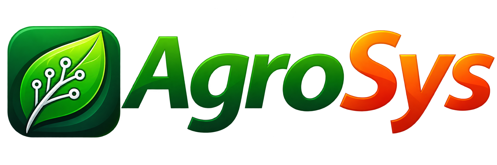
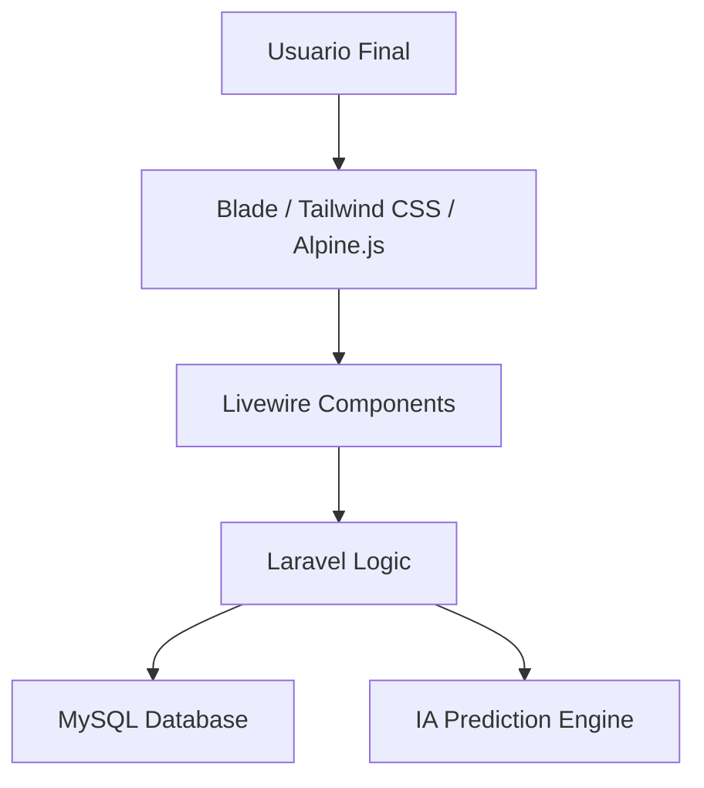

<p align="center"><a href="https://laravel.com" target="_blank"></a></p>
<p align="center">
<a href="https://github.com/laravel/framework/actions"></a>
<a href="https://packagist.org/packages/laravel/framework"></a>
<a href="https://packagist.org/packages/laravel/framework"></a>
<a href="https://packagist.org/packages/laravel/framework"></a>
</p>

# 🌿 AgroSys: Ecosistema de Inteligencia Agrícola

<p align="center">
  
  
  
  
  
</p>

---

## 🏛️ Arquitectura del Sistema (DSS)

AgroSys está diseñado bajo una arquitectura de **Sistemas de Apoyo a las Decisiones (DSS)**, utilizando un stack monolítico moderno de alta reactividad.



### 🛰️ Capas Técnicas

| Dimensión | Tecnología                                          | Propósito Estratégico |
| :--- |:----------------------------------------------------| :--- |
| **Frontend** | **Blade(HTML + PHP)  & Tailwind(Estilos modernos)** | Interfaz atomizada con diseño utilitario y modo oscuro dinámico. |
| **Interactividad** | **Livewire & Alpine.js**                            | Reactividad sin la complejidad de un SPA tradicional. |
| **Backend** | **Laravel 11**                                      | Orquestador de lógica de negocio, colas y seguridad. |
| **Persistencia** | **MySQL**                                           | Almacenamiento relacional con optimización de índices para telemetría. |

---

**🖥️ FRONTEND**
- Blade (HTML + PHP)
- Tailwind CSS (Estilos modernos)
- Alpine.js (Interactividad sin JavaScript complejo)
- React (solo para: 🗺️Mapas, 📊Dashboard, 📈 Gráficos (Recharts/Chart.js), 🌦️Clima & IA)

**⚙️ BACKEND**
- Laravel (Framework PHP)
- Livewire (Componentes dinámicos sin JS)

**🔐 AUTENTICACIÓN**
- Breeze (Login, Registro, Restablecer contraseña)

**🗄️ BASE DE DATOS**
- MySQL
---
## 🛠️ Requerimientos del Centro de Datos

Para el despliegue óptimo, el servidor debe cumplir las siguientes especificaciones:

> [!IMPORTANT]
> **PHP 8.4+** es obligatorio para aprovechar las mejoras de rendimiento y tipado de Laravel 11.

- **Engine:** PHP 8.4.24 ó superior.
- **Dependency Manager:** Composer 2.x.
- **JavaScript Runtime:** Node.js 18.x LTS.
- **React**: React 19.2.8 ó superior
- **Relational DB:** MySQL 8.4.11 ó superior

---

## 🚀 Protocolo de Despliegue

### 🌑 1. Descarga del proyecto
Descarga los datos con que trabajar
```bash
git clone https://github.com/Roosivelt-td/AgroSys.git
cd AgroSys
```
### 🌑 2. Génesis del Proyecto
Inicialización del entorno bajo los estándares de Laravel 11.
```bash
composer install
```

### 🎨 3. Compilación de la Interfaz
Instalación de dependencias de diseño y compilación de activos.
```bash
npm install && npm run build
```

### 💾 4. Configuración Energética (.env)
Enlace de la aplicación con el motor de base de datos.
```env
DB_CONNECTION=mysql
DB_HOST=127.0.0.1
DB_DATABASE=NOMBRE_DB
DB_USERNAME=usuario
DB_PASSWORD=password
```

### 🧪 5. Migración de Planos y Semillas
Ejecución de las migraciones para crear la estructura de tablas y cargar los catálogos maestros.

GENERAR CLAVE ¡PASO IMPORTANTE!

```bash
php artisan key:generate
```
Migraciones de laravel - PHP
```bash
php artisan migrate:fresh --seed
```
---
## ⚙️ Centro de Operaciones (Comandos)

| Acción | Comando |
| :--- | :--- |
| **Levantar Servidor** | `php artisan serve` |
| **Modo Desarrollo** | `npm run dev` |
| **Actualizar Núcleo** | `composer update` |
| **Limpiar Caché** | `php artisan optimize:clear` |

---
---
# 🐳 Despliegue e Instalación mediante Docker
#### Ejecución rápida en entornos aislados.

### 📥 1. Clonar el repositorio
```bash
git clone https://github.com/Roosivelt-td/AgroSys.git
cd AgroSys
```

### 📝 2. Configuración del Entorno (.env)
> [!IMPORTANT]
> Este paso es vital si no existe el archivo .env se tiene que crearlo ya que no funcionara la Base de Datos sin esa configuracion.
```bash
cp .env.example .env
```
Edita el archivo `.env` con los parámetros de Docker:
```env
DB_CONNECTION=mysql
DB_HOST=mysql
DB_PORT=3306
DB_DATABASE=agrosys
DB_USERNAME=agrosys
DB_PASSWORD=agrosys123
```

### 🏗️ 3. Orquestación de Contenedores
```bash
docker compose up -d --build
```

### 🔑 4. Generación de Llave de Seguridad
> [!IMPORTANT]
> Este paso es vital para el cifrado de sesiones y datos.
```bash
docker exec agrosys-app php artisan key:generate
```

### 💾 5. Inicialización de Base de Datos
Crea la estructura de tablas y carga los datos maestros (seeders).
```bash
docker exec agrosys-app php artisan migrate:fresh --seed
```

### 🔄 6. Actualización de Código
Si realizas cambios en el código PHP o vistas, simplemente reinicia los servicios:
```bash
docker compose up -d
```

### ✅ 7. Verificación Final
Accede al sistema desde tu navegador:
- **URL:** [http://localhost:8000](http://localhost:8000)
- **Credenciales Super Admin:** 
  - 📧 `admin@agrosys.com`
  - 🔑 `password`

### 📋 COMANDOS COMPLETOS
```
# 1. Limpiar caché de configuración
docker exec agrosys-app php artisan config:clear

# 2. Generar caché de configuración (para producción)
docker exec agrosys-app php artisan config:cache

# 3. Limpiar caché de la aplicación
docker exec agrosys-app php artisan cache:clear

# 4. Limpiar caché de vistas
docker exec agrosys-app php artisan view:clear

# 5. Generar caché de vistas (para producción)
docker exec agrosys-app php artisan view:cache

# 6. Limpiar caché de rutas
docker exec agrosys-app php artisan route:clear

# 7. Generar caché de rutas (para producción)
docker exec agrosys-app php artisan route:cache

# 8. Limpiar TODOS los cachés (recomendado después de cambios)
docker exec agrosys-app php artisan optimize:clear
```
### 🔄 EJECUTAR VARIOS COMANDOS A LA VEZ
```
# Limpiar todo (recomendado después de cambios importantes)
docker exec agrosys-app php artisan optimize:clear

# Regenerar todo (para producción)
docker exec agrosys-app php artisan optimize
```

### **funcionamiento de usuarios**

- **Super Admin**: control total del sistema, configuraciones, usuarios, organizaciones y todos los módulos.
- **Admin:** administra su organización, usuarios y operaciones agrícolas.
- **Supervisor:** supervisa agricultores, terrenos, cultivos y actividades asignadas.
- **Agricultor:** registra y consulta únicamente sus propios terrenos, cultivos, labores, cosechas y ventas.

## 🏆 Estatus del Proyecto

- [x] **Traducción:** 🇪🇸 Interfaz totalmente en español.
- [x] **UX/UI:** 🌓 Soporte nativo para Light Mode.
- [x] **Seguridad:** 🛡️ Roles diferenciados (Admin, Agricultor, Supervisor).
- [x] **Preparado para IA:** 🧠 Módulos predictivos en fase de diseño.

---

<p align="center">
  <b>AgroSys</b> • <i>Transformando datos en cosechas inteligentes</i><br>
  Hecho con ❤️ para el sector agrícola
  <br>

</p>
